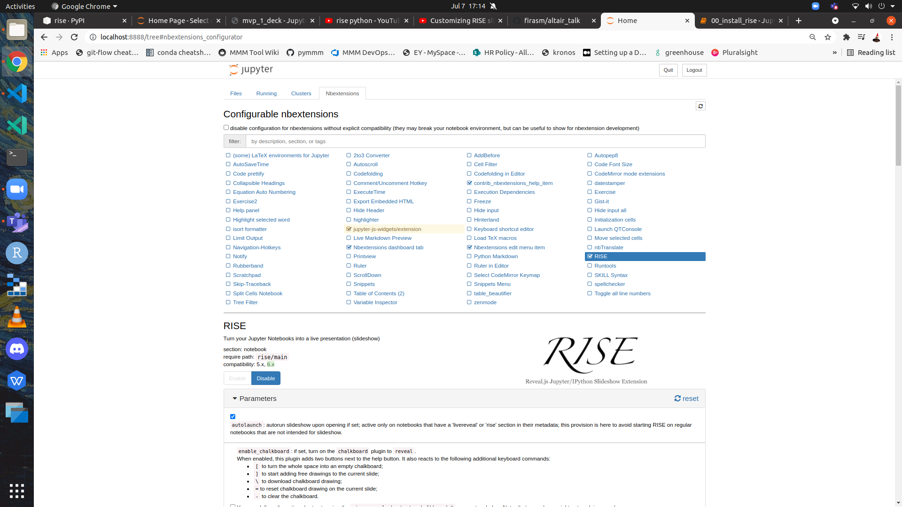

# RISE boilerplate

### Install RISE

```
conda create --name rise python=3.8
conda activate rise
pip install jupyter RISE
conda install -c conda-forge jupyter_contrib_nbextensions
jupyter contrib nbextension install --user
conda install -c conda-forge jupyter_nbextensions_configurator
```

### Enable Jupyter Notebook extension for RISE





### Run Notebook 


* Run `01_rise_theme_install.ipynb`
* Restart notebook and verify theme has been applied


### How to use RISE


## Using conda env yml file

To recreate the env using conda use `environment.yml`.


### Reference:

* https://www.youtube.com/watch?v=dAxWpE7_v1A
* https://github.com/firasm/altair_talk